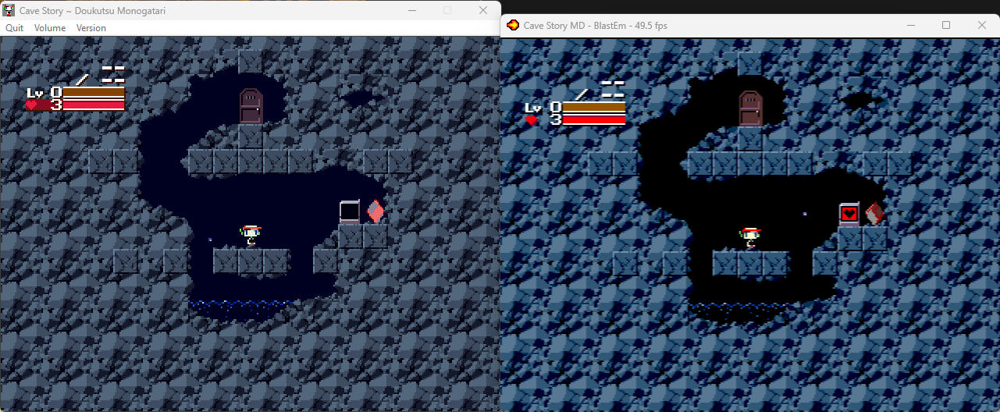

# 洞窟物語MD

[Video](http://www.youtube.com/watch?v=aZU133ekDVk)

[English README](README.md)

これは洞窟物語というただなPCゲームのメガドライブに移植したものです。
エンジンはC言語とM68Kアセンブリ言語でゼロから作りました。
どんなコンソールやエミュレーターでも動くはずだ。
まだ開発中けど、すべてのステージとエンディングがクリアできる。

## ダウンロード
安定版リリースは[Releases](https://github.com/andwn/cave-story-md/releases)タブで入手できます。

まだあまりテストされていない最新のビルドは[こちら](https://tenshi.skychase.zone/cs/)で入手できます。

## プレイ方
もしも６ボタンコントローラーを持っています：

- Cボタン　⇒　ジャンプ、確認
- Bボタン　⇒　ショット、キャンセル
- Aボタン　⇒　ゲームを急がせる（テストの機能性）
- Zボタン　⇒　武器を変更（右側）
- Yボタン　⇒　武器を変更（左側）
- Xボタン　⇒　地図を発表（マップシステムが必要）
- スタート　⇒　メニューを発表

注意：NPCと話したり、ドアに入ったりするには、下を押してください。

３ボタンコントローラーの場合は、Aボタンが武器を変更のボタンになります。

### チート
- ステージ選択：　上、下、左、右、A+スタート
- 無敵：　上、上、下、下、左、右、左、右、A+スタート

無敵中でも、溺れ死んだり、埒外死んだりできます。

コードを入力した際は、セーブができません。ご注意ください。

## ビルド方
1. 依存なソフトウェア: `build-essential libpng-dev` 
2. GCCツールチェインも必要、例えば [Marsdev](http://github.com/andwn/marsdev)。
3. `git clone https://github.com/andwn/cave-story-md`
4. `cd cave-story-md` と `make`
  - 翻訳ため： `make translate`

## 一瞬FAQ
もっと詳しいFAQ（英語）：　[FAQ.md](doc/FAQ.md)

### これは正式なものですか？
いいえ、ファン作品です。

### なぜ作ったのですか？
メガドライブ開発の勉強と自分の楽しみのため。

### なぜスーファミではないのですか？
スーファミに興味が少ないから。

### いつ完成しますか？
バグが少なくなって気にならなくなったら。

### 物理的なリリースがありますか？
無いです。

### カートは作れますか？
自分自身や友人のためにカートを作るのは自由ですが、*販売しないでください*。

### カートを売っている人を見ました。
それは詐欺ですよ。お金を返すのを要すってください。

## License
- コード: MIT
- 音楽: CC-BY-NC
- その他全て: Copyright Studio Pixel

詳細はこちら（英語です、すみません）：　[LICENSE.md](doc/LICENSE.md).

基本的には、コードを好きなように使用することはできますが、ゲーム資産を販売したり、商用作品に使用したりしないでください。

## Thanks
めんどくさいな、英語のREADMEをチェックしてください。

## 翻訳版
Mostly taken from cavestory.org

- 英語: [Aeon Genesis Translations](http://agtp.romhack.net/)
- スペイン語: [Vagrant Traducciones](http://vagrant.romhackhispano.org)
- フランス語: [Max le Fou](http://cavestory.maxlefou.com/)
- ドイツ語: [Reality Dreamers](http://www.reality-dreamers.de/)
- イタリア語: [Simon M.](mailto:simonogatari@gmail.com)
- ポルトガル語: [Andre Silva](mailto:andreluis.g.silva@gmail.com)
- ブラジルのポルトガル語: [Alex "Foffano"](mailto:foffano@gmail.com)
- （単体字）中国語: Hydrowing
- 韓国語: Anonymous
