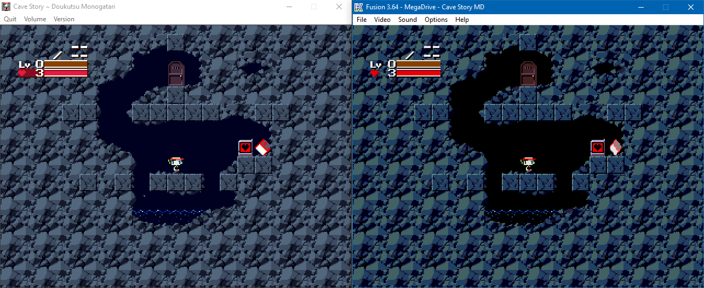

# Cave Story MD

[Video](http://www.youtube.com/watch?v=aZU133ekDVk)

[日本語はこちら](README-ja.md)

This is a rewrite/port of the popular freeware game Cave Story for Sega Mega Drive/Genesis.
It should work on any console or emulator. The main story is "finished", only little things and bugfixes remain.

## Download
"Stable" releases can be found in the [Releases](https://github.com/andwn/cave-story-md/releases) tab.

The latest builds that have not gone through as much testing are available [here](https://tenshi.skychase.zone/cs/).

## Default Controls
If you have a 6 button controller:

- `C` - Jump, confirm
- `B` - Shoot
- `A` - Fast forward through scripted events
- `Y`, `Z` - Switch weapon
- `X` - Map system
- `Start` - Pause / Item Menu

For 3 button, `A` cycles through weapons. The rest is the same.

### Cheats
- Stage Select: up, down, left, right, A + Start. Like Sonic.
- Infinite health/ammo: up, up, down, down, left, right, left, right, A + Start.

You can still get crushed, drown and fall out of bounds.

Note that you can't load or save the game while cheating (including the counter).

## Compilation
1. Dependencies: `build-essential libpng-dev python3` and a GCC cross compiler for "m68k-elf" such as [Marsdev](http://github.com/andwn/marsdev).
2. Clone & `make`
  - For translations: `make translate`

## Other Information
- [FAQ](doc/FAQ.md)
- [Differences from PC](doc/DIFFERENCES.md)
- [VRAM Layout](doc/VRAM.md)

## License
- Source Code: MIT
- Art and Story: Copyright Studio Pixel
- Music Covers: CC-BY-NC

Further details in [LICENSE.md](doc/LICENSE.md).

tl;dr - Use the code however you like, but the assets and game itself can not be sold or used in commercial works.

## Thanks
I did not know how to sort this list, so I did it alphabetically.

- andwhyisit: A whole lot of testing. Automated builds.
- DavisOlivier: Helped with a few music tracks.
- Sik: Mega Drive tech support. Made the font used in-game.
- Other people I probably forgot

## Translations
Mostly taken from cavestory.org

- English: [Aeon Genesis Translations](http://agtp.romhack.net/)
- Spanish: [Vagrant Traducciones](http://vagrant.romhackhispano.org)
- French: [Max le Fou](http://cavestory.maxlefou.com/)
- German: [Reality Dreamers](http://www.reality-dreamers.de/)
- Italian: [Simon M.](mailto:simonogatari@gmail.com)
- Portuguese: [Andre Silva](mailto:andreluis.g.silva@gmail.com)
- BR Portuguese: [Alex "Foffano"](mailto:foffano@gmail.com)
- Chinese (Simplified): Hydrowing
- Korean: Anonymous
