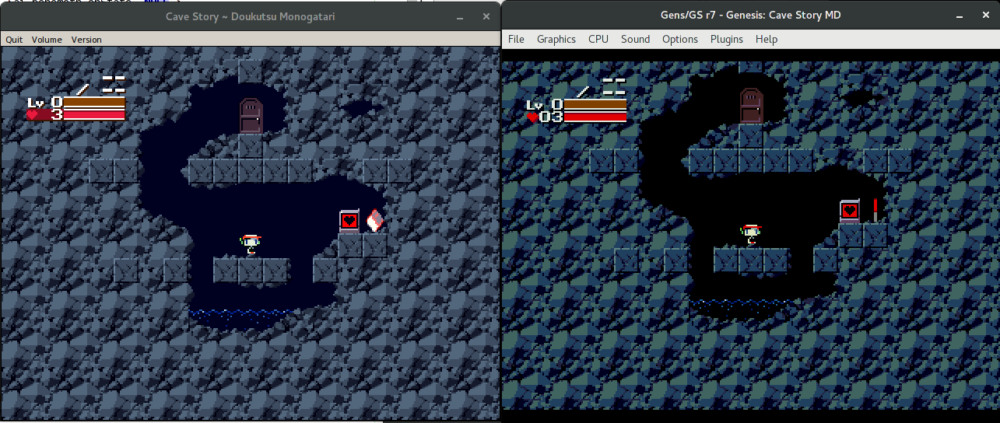

# Cave Story MD

This is a rewrite/port of the popular freeware game Cave Story. It is built to run on a Genesis/Mega Drive.
Tested to work on Kega Fusion, Gens GS, and an NTSC Genesis Model 1.
The engine is built using SGDK, and written almost entirely in C.

#### Download ROM
See: [Releases](https://github.com/andwn/cave-story-md/releases)

#### Is this beatable?
Not yet, check out the [TODO list](doc/TODO.md) for progress.
- The game can also be saved and resumed. I have yet to notice any data related bugs. The SRAM is not compatible with the real game, but I wrote a [converter](tools/prof2sram).

#### Controls
- C - Jump, confirm
- B - Shoot, cancel
- Y, Z - Switch weapon
- Start - Item Menu

#### How to build? (GNU/Linux)
1. Set up [Gendev](https://github.com/kubilus1/gendev.git)
2. Clone the project and do `make`.

#### How to build? (Windows)
**Note**: I don't use Windows and can't guarantee this will work. If it does fail, show me the make output.

1. Download and install [SGDK](https://github.com/Stephane-D/SGDK.git) using the instructions from that page.
2. Clone the repo `git clone https://github.com/andwn/cave-story-md.git`
3. Run "build.bat" and if everything goes well the ROM should be located at out/rom.bin.
  - Sometimes GCC will throw an error about heap space, especially on newer versions of Windows. Just retry until it completes or you get a different error.

#### Caveats
- Many of the colors are more vivid or even wrong sometimes due to palette limitations.
- Some effects like the sprinkler and screen fading are not possible or difficult to implement without lag

#### Legal Disclaimer
The art assets and sound effects are property of Studio Pixel and are in no way owned by me.
This repository focuses on the engine and music conversions.
